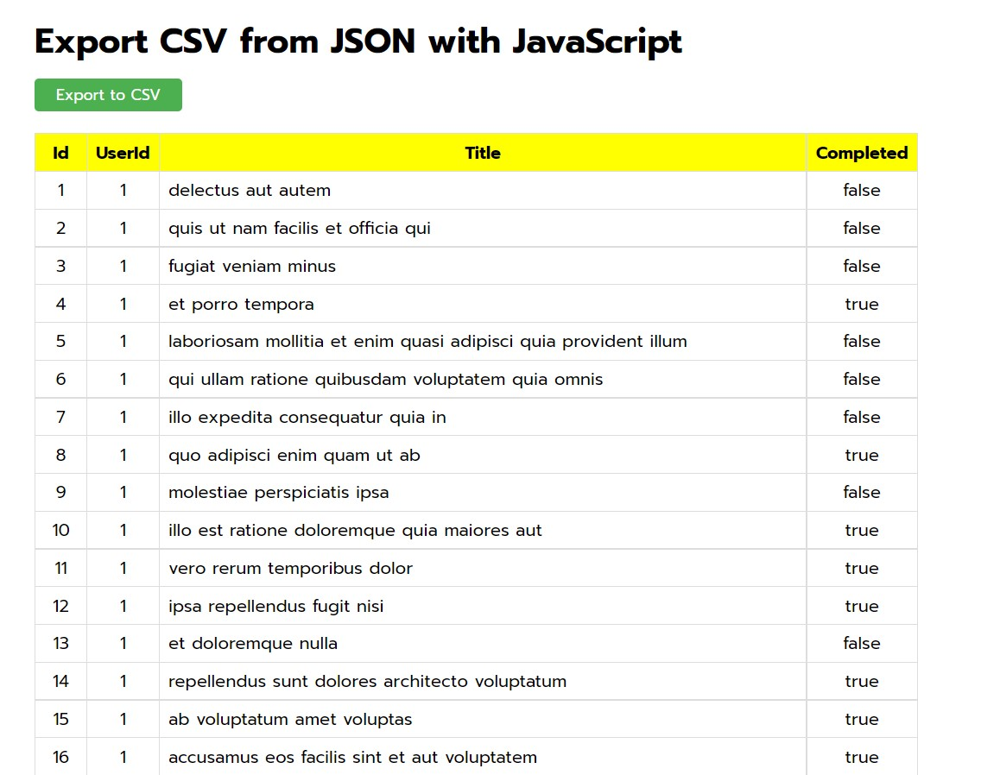

# Export CSV From JSON with JavaScript

This web application Fetch data from web server to get json data. Then, convert json data to csv file and HTML table. Overall, I use only JavaScript to make this function. I get some trick of how to create download button from YouTube. The method is using Blob and a tag to create download button.

### Technologies

